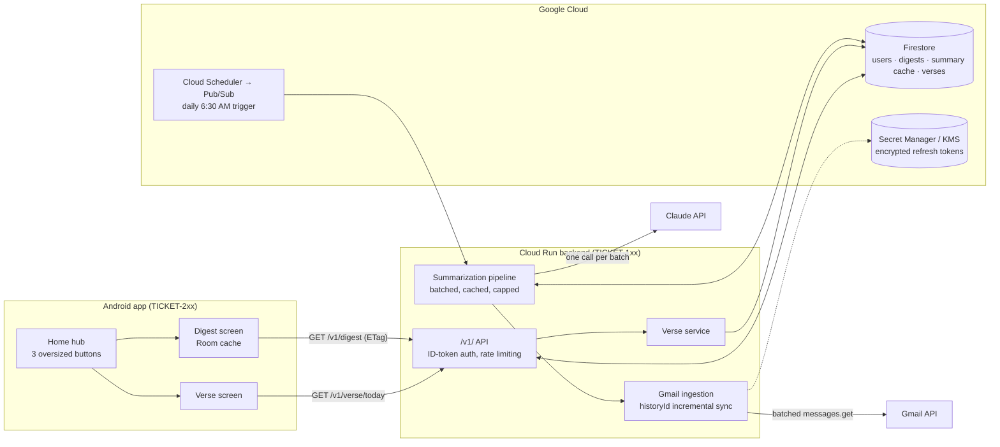
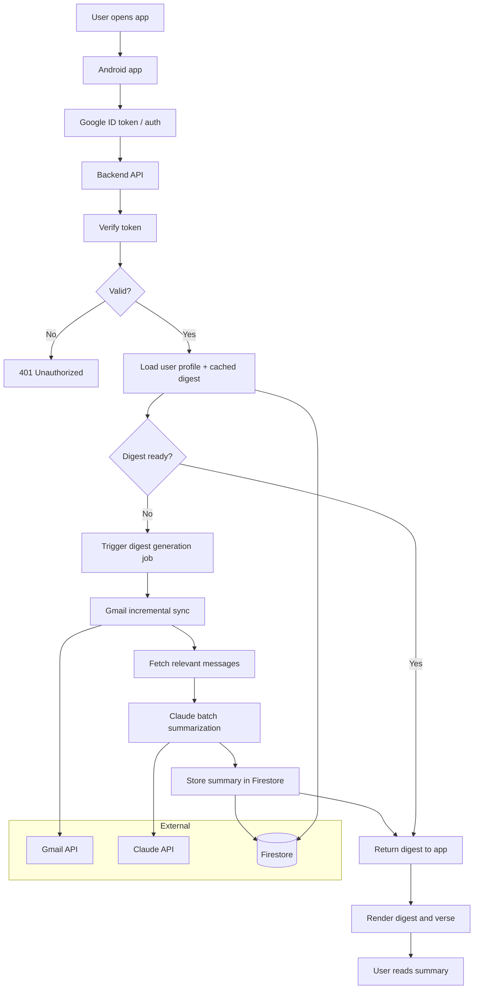

# Enat — system architecture

How a Gmail inbox becomes a calm Amharic digest on an accessible home screen.
This describes the target architecture the ticket backlog builds toward; each
component is tagged with the ticket that introduces it.

## The system at a glance



Plain-text version of the same flow:

```
Android app ──HTTPS/ID token──▶ Cloud Run API ──▶ Firestore (digests, cache)
                                     │
     Cloud Scheduler ──Pub/Sub──▶ digest job
                                     ├──▶ Gmail API   (incremental sync, batched)
                                     └──▶ Claude API  (one batched call per digest)
```

## Chat flow



Plain-text version of the same chat flow:

```
User opens app
  -> Android app
  -> Google ID token auth
  -> Backend API
  -> verify token
  -> if valid: load user + cached digest
  -> if no digest: trigger generation job
  -> Gmail incremental sync
  -> summarize with Claude in one batched call
  -> store digest in Firestore
  -> return digest to app
  -> render digest + verse
```

## Components

### Android app (`/android`, Epic 2)

Single-module Compose app, MVVM with unidirectional data flow, Hilt, Retrofit,
coroutines/Flow (TICKET-201). Three screens matter:

- **Home hub** (TICKET-203) — three Amharic buttons ≥64dp, everything reachable
  in ≤2 taps, TalkBack-complete, WCAG AA contrast.
- **Digest** (TICKET-204) — renders the daily digest from a Room cache so it
  opens instantly and works offline; pull-to-refresh requests on-demand
  generation.
- **Verse** (TICKET-205) — cached daily verse plus a WorkManager morning
  notification.

Sign-in uses Credential Manager with the server auth-code flow (TICKET-202):
the phone never holds the Gmail refresh token; it sends an auth code the
backend exchanges and stores encrypted.

### Backend (`/backend`, Epic 1)

Containerized Node/TypeScript service on Cloud Run, scale-to-zero
(TICKET-101). Every request carries a Google ID token, verified against cached
JWKS for signature/audience/expiry and rate-limited per user (TICKET-102).

- **Gmail ingestion** (TICKET-103) — `historyId`-based incremental sync (full
  sync only on first run), batched `messages.get` with `format=metadata` first,
  bodies fetched only for messages that will be summarized, HTML stripped and
  truncated to a token budget, exponential backoff on 429/5xx.
- **Summarization pipeline** (TICKET-104) — one Claude API call per digest
  batch, never per email. Output is schema-validated JSON (category, 1–2
  sentence Amharic summary, urgency flag), retried once on parse failure.
  Results are cached in Firestore by `messageId` so an email is never
  summarized twice. Input tokens are hard-capped per digest; overflow emails
  get heuristic category-only treatment. Prompts are versioned in the repo.
- **Digest API** (TICKET-105) — Cloud Scheduler → Pub/Sub triggers an
  idempotent generation job every morning, so `GET /v1/digest` serves a
  pre-built document in <300ms p95. ETag support lets the app skip unchanged
  downloads.
- **Verse service** (TICKET-106) — `GET /v1/verse/today` from a curated
  365-entry rotation in Firestore, 24h edge cache, hard-coded fallback verse.

### Data (Firestore)

| Collection | Contents | Ticket |
| --- | --- | --- |
| `users` | uid, email, locale, reference to encrypted refresh token | 102 |
| `digests` | date, userId, sections[], generatedAt, emailCount | 105 |
| summary cache | per-`messageId` category + Amharic summary | 104 |
| `verses` | 365-entry curated rotation, Amharic + English | 106 |

Refresh tokens live in Secret Manager or as KMS-encrypted Firestore fields —
never plaintext (TICKET-102).

## A day in the life of a digest

1. **6:30 AM** — Cloud Scheduler publishes to Pub/Sub; the generation job wakes
   the Cloud Run service.
2. **Sync** — the job asks Gmail for changes since the stored `historyId`; an
   unchanged inbox costs ≤2 API calls.
3. **Summarize** — uncached emails go to the Claude API in one batched call;
   the schema-validated result is cached per `messageId` and assembled into a
   digest document in Firestore. Re-running the job for the same day is
   idempotent — no duplicates, no double-billing.
4. **Morning** — the app opens, hits `GET /v1/digest` with its last ETag, gets
   the pre-built digest (or a 304), stores it in Room, and renders large
   Amharic cards. From then on the digest reads fine in airplane mode.

## Cross-cutting rules

- **Cost** — scale-to-zero, incremental sync, batched LLM calls, per-message
  caching, token caps, edge-cached verse. Target: ≤$0.05 per daily digest at
  50 emails/day; billing alerts at $10/$25 (TICKET-003, 302).
- **Privacy** — raw email bodies are never persisted server-side beyond the
  request and never logged; only summaries are cached. Minimum Gmail scopes.
  TLS everywhere. Full policy in `docs/privacy.md` when TICKET-303 lands.
- **Reliability** — errors are handled at the boundary: 5xx never leaks stack
  traces, consent revocation surfaces a "reconnect" card instead of a crash,
  a missed schedule falls back to on-demand generation, verse lookup failure
  falls back to a bundled verse.
- **Observability** (TICKET-302) — structured JSON logs with request IDs,
  dashboards for digest success rate / Gmail errors / LLM cost per day, alerts
  on job failure and spend thresholds.

## Environments

`staging` and `prod` are separate GCP projects with separate service accounts
and minimal IAM (TICKET-003). The Android `debug` variant points at staging,
`release` at prod (TICKET-201). CI deploys staging automatically on merge to
`main` (TICKET-002).
